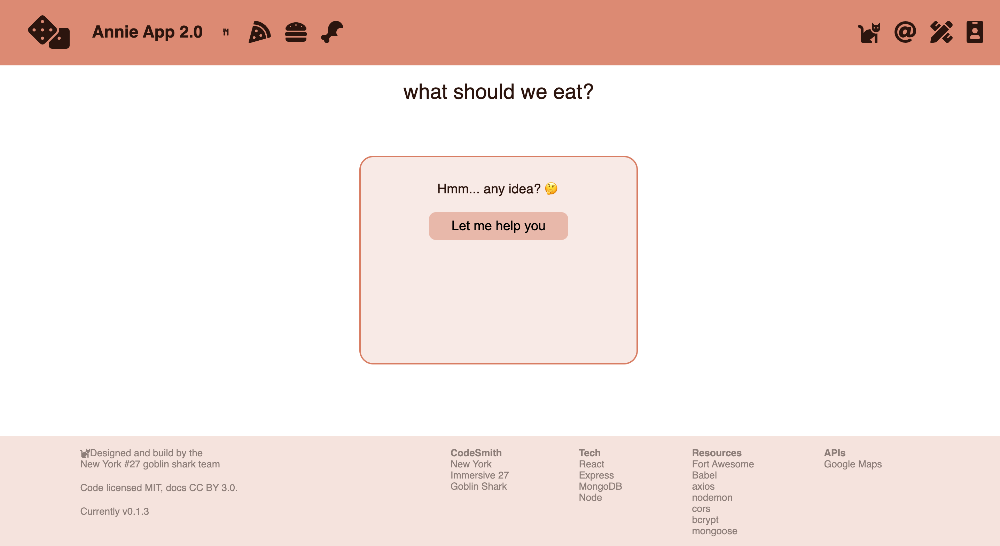

<!-- PROJECT LOGO -->
 
<h1 align="center">Annie App</h1>

Annie app v.1.0

## Usage

Get a recommended menu and find a nearby restaurant:

- Click ‘let me help you’ button  
  

- Add options as many as you want, and click ‘show me the menu’ button  
  

- You got a menu! Now enter the zip code to find a nearby restaurant!  
  

- Get a restaurant information on Google map!  
  

